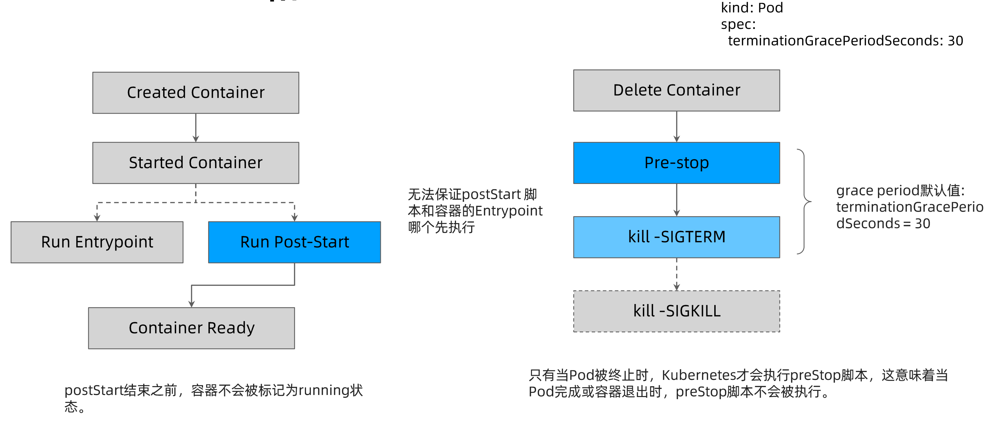
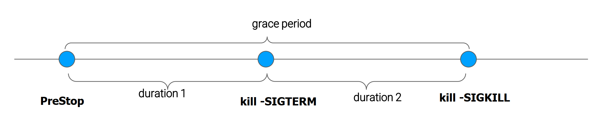

## pod状态计算细节

| kubectl get pod 返回的状态                                                 | Pod Phase | Conditions                                               |
| -------------------------------------------------------------------------- | --------- | -------------------------------------------------------- |
| Completed                                                                  | Succeeded |                                                          |
| ContainerCreating                                                          | Pending   |                                                          |
| CrashLoopBackOff                                                           | Running   | Container exits                                          |
| CreateContainerConfigError                                                 | Pending   | eg: configmap "test" not found                           |
| ErrImagePull / ImagePullBackOff / Init:ImagePullBackOff / InvalidImageName | Pending   | Back-off pulling images                                  |
| Error                                                                      | Failed    | restartPolicy: Never & container exits with Error(not 0) |
| Evicted                                                                    | Failed    | reason: Evicted                                          |
| Init:0/1                                                                   | Pending   | Init Containers don't exit                               |
| Init:CrashLoopBackoff / Init:Error                                         | Pending   | Init container crashed                                   |
| OOMKilled                                                                  | Running   | Containers are OOMKilled                                 |
| StartError                                                                 | Running   | Containers cannot be started                             |
| Unknown                                                                    | Running   | Node NotReady                                            |
| OutOfCpu / OutOfMemory                                                     | Failed    | Scheduled, but it cannot pass kubelet admit                                                         |

## 确保Pod的高可用的注意点

避免容器进程被终止，避免Pod被驱逐
- 设置合理的`resources.memory`的`limit`，防止容器进程被OOMKill
- 设置合理的`emptydir.sizeLimit`并且确保数据写入不超过emptyDir的限制，防止Pod被驱逐

## Pod的QoS分类

QoS分为三类，从高到低分别是：
- Guaranteed：
	- Pod的每个容器都设置了资源CPU和内存需求
	- Limits和requests的值完全一致
- Burstable：
	- 至少一个容器制定了CPU或内存request
	- Pod的资源需求不符合Guaranteed QoS的条件，也就是requests和limits不一致
- BestEffort：
	- Pod中的所有容器都未指定CPU或内存资源需求requests

当计算节点检测到内存压力时，Kubernetes会按照 BestEffort -> Burstable -> Guaranteed 的顺序依次驱逐Pod

## Pod的优先级

PriorityClass 是一个无命名空间对象，它定义了从优先级类名称到优先级整数值的映射。 名称在 PriorityClass 对象元数据的 `name` 字段中指定。 值在必填的 `value` 字段中指定。值越大，优先级越高。 PriorityClass 对象的名称必须是有效的 [DNS 子域名](https://kubernetes.io/zh-cn/docs/concepts/overview/working-with-objects/names#dns-subdomain-names)， 并且它不能以 `system-` 为前缀。

PriorityClass 对象可以设置任何小于或等于 10 亿的 32 位整数值。 较大的数字是为通常不应被抢占或驱逐的关键的系统 Pod 所保留的。 集群管理员应该为这类映射分别创建独立的 PriorityClass 对象。

当启用 Pod 优先级时，调度程序会按优先级对悬决 Pod 进行排序， 并且每个悬决的 Pod 会被放置在调度队列中其他优先级较低的悬决 Pod 之前。 因此，如果满足调度要求，较高优先级的 Pod 可能会比具有较低优先级的 Pod 更早调度。 如果无法调度此类 Pod，调度程序将继续并尝试调度其他较低优先级的 Pod。

## QoS和PriorityClass的区别

QoS的级别是kubernetes做驱逐时的参考依据，而PriorityClass是kubernetes调度时的依据。

## 健康检查探针

健康探针类型分为
- livenessProbe
	- 探活，当检查失败时，意味着该应用进程已经无法正常提供服务，kubelet会终止该容器进程并按照restartPolicy决定是否重启
- readinessProbe
	- 就绪状态检查，当检查失败时，意味着应用进程正在运行，但因为某些原因不能提供服务，Pod状态会被标记为NotReady
- startupProbe
	- 在初始化阶段（Ready之前）进行的健康检查，通常用来避免过于频繁的监测影响应用启动

探测方法包括：
- ExecAction：在容器内部运行指定命令，当返回码为0时，探测结果为成功
- TCPSocketAction：由kubelet发起，通过TCP协议检查容器IP和端口，当端口可达时，探测结果为成功
- HTTPGetAction：由kubelet发起，对Pod的IP和指定端口以及路径进行HTTPGet操作，当返回码小于400时，探测结果为成功

### 探针属性

| 参数                | 描述                                                                                                |
| ------------------- | --------------------------------------------------------------------------------------------------- |
| initialDelaySeconds | 容器启动后要等待多少秒后才启动启动、存活和就绪探针， 默认是 0 秒，最小值是 0。                      |
| periodSeconds       | 执行探测的时间间隔（单位是秒）。默认是 10 秒。最小值是 1。                                          |
| timeoutSeconds      | 探测的超时后等待多少秒。默认值是 1 秒。最小值是 1。                                                 |
| successThreshold    | 探针在失败后，被视为成功的最小连续成功数。默认值是 1。 存活和启动探测的这个值必须是 1。最小值是 1。 |
| failureThreshold    |          当探测失败时，Kubernetes 的重试次数。 对存活探测而言，放弃就意味着重新启动容器。 对就绪探测而言，放弃意味着 Pod 会被打上未就绪的标签。默认值是 3。最小值是 1。                                                                                           |

### ReadinessGates

你的应用可以向 PodStatus 中注入额外的反馈或者信号：**Pod Readiness（Pod 就绪态）**。 要使用这一特性，可以设置 Pod 规约中的 `readinessGates` 列表，为 kubelet 提供一组额外的状况供其评估 Pod 就绪态时使用。

就绪态门控基于 Pod 的 `status.conditions` 字段的当前值来做决定。 如果 Kubernetes 无法在 `status.conditions` 字段中找到某状况， 则该状况的状态值默认为 "`False`"。

该状态应该由某控制器修改。

下面是一个例子：

```yaml
kind: Pod
...
spec:
  readinessGates:
    - conditionType: "www.example.com/feature-1"
status:
  conditions:
    - type: Ready                              # 内置的 Pod 状况
      status: "False"
      lastProbeTime: null
      lastTransitionTime: 2018-01-01T00:00:00Z
    - type: "www.example.com/feature-1"        # 额外的 Pod 状况
      status: "False"
      lastProbeTime: null
      lastTransitionTime: 2018-01-01T00:00:00Z
  containerStatuses:
    - containerID: docker://abcd...
      ready: true
...
```

## 定义 postStart 和 Prestop 处理函数

Kubernetes 支持 postStart 和 preStop 事件。 当一个容器启动后，Kubernetes 将立即发送 postStart 事件；在容器被终结之前， Kubernetes 将发送一个 preStop 事件。容器可以为每个事件指定一个处理程序。



下面是对应 Pod 的配置文件：

```yaml
apiVersion: v1
kind: Pod
metadata:
  name: lifecycle-demo
spec:
  containers:
  - name: lifecycle-demo-container
    image: nginx
    lifecycle:
      postStart:
        exec:
          command: ["/bin/sh", "-c", "echo Hello from the postStart handler > /usr/share/message"]
      preStop:
        exec:
          command: ["/bin/sh","-c","nginx -s quit; while killall -0 nginx; do sleep 1; done"]
```

在上述配置文件中，你可以看到 postStart 命令在容器的 `/usr/share` 目录下写入文件 `message`。 命令 preStop 负责优雅地终止 nginx 服务。当因为失效而导致容器终止时，这一处理方式很有用。

## 结束Pod的生命周期

### terminationGracePeriodSeconds 的分解



### terminating pod 的经验

terminationGracePeriodSeconds 默认时长是30秒。

如果不关心Pod的终止时长，那么无需采取特殊措施。

如果希望快速终止应用进程，那么可采取如下方案：
- 在preStop script 中主动退出进程
- 在主容器进程中使用特定的初始化进程

优雅的初始化进程应该：
- 正确处理系统信号量，将信号量转发给子进程
- 在主进程退出之前，需要先等待并确保所有子进程退出
- 监控并清理孤儿子进程

>bash / sh 会会忽略SIGTERM信号量，因此kill -SIGTERM 会永远超时，若应用使用 bash / sh 作为Entrypoint，则应避免过长的grace period。

## 容器应用可能面临的进程中断

| 类型                           | 影响                                                               | 建议                                                                                                                           |
| ------------------------------ | ------------------------------------------------------------------ | ------------------------------------------------------------------------------------------------------------------------------ |
| kubelet升级①                   | 不重建容器                                                         | 无影响                                                                                                                         |
| kubelet升级②                   | 1. 重建容器；2. Pod进程会被重启                                   | 1. 冗余部署；2. 跨故障域部署                                                                                                   |
| 主机操作系统升级、节点手工重启 | 1. 节点重启；2. Pod进程会被终止数分钟（10分钟左右）                | 1. 跨故障域部署；2. 增加Liveness、Readiness探针；3. 设置合理的NotReady node的Toleration时间                                    |
| 节点下架、送修①                | 1. 节点会被drain、重启或者从集群中被删除；2. Pod进程会被终止数分钟 | 1. 跨故障域部署；2. 利用Pod distruption budget避免节点被drain导致Pod被意外删除而影响业务；3. 利用preStop script做数据备份等操作 |
| 节点下架、送修②                | Pods will be down for about 10 minutes                             | 1. 跨故障域部署；2. 设置合理的NotReady node的Toleration时间                                                                    |
| 节点崩溃                       | Pod进程会被终止15分钟左右                                          | 跨故障域部署                                                                                                                               |

>`PodDisruptionBudget(PDB)` 将限制在同一时间因自愿干扰导致的多副本应用中发生宕机的 Pod 数量。 例如，基于票选机制的应用希望确保运行中的副本数永远不会低于票选所需的数量。 Web 前端可能希望确保提供负载的副本数量永远不会低于总数的某个百分比。