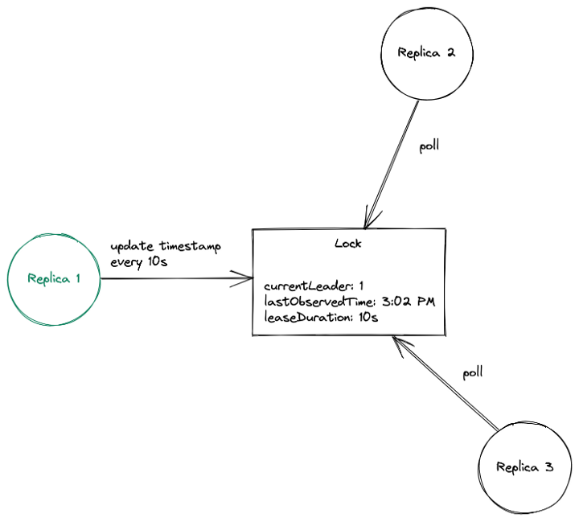

## 简介

近年来，随着对可靠的系统和基础设施的需求增加，"高可用性 "这个词也越来越受欢迎。在分布式系统中，高可用性通常是指最大限度地延长正常运行时间和使系统具有容错性。在高可用性中，一个常见的做法是使用冗余来减少单点故障。准备你的系统和服务的冗余可能很简单，只是在负载平衡器后面部署更多的副本。虽然这样的配置对许多应用来说是可行的，但有些使用情况需要仔细协调各副本，以使系统正常工作。

一个很好的例子是，当一个[[Kubernetes]]控制器被部署为多个实例时。为了防止任何意外的行为，领导者选举过程必须确保在副本中选出一个领导者，并且是唯一一个积极协调集群的人。其他的实例应该保持不活动，但准备在领导者实例失败时接管。

## Kubernetes中的Leader election

Kubernetes中的领导者选举过程很简单。它从创建一个锁对象开始，领导者定期更新当前的时间戳，作为通知其他副本其领导地位的一种方式。这个锁对象可以是Lease、ConfigMap或Endpoint，也持有当前领导者的身份。如果领导者未能在给定的时间间隔内更新时间戳，就会被认为是崩溃了，这时不活跃的副本就会通过更新锁的身份来争夺领导权。成功获得锁的Pod将成为新的领导者。



我们将使用的示例应用程序可以在[这里](https://github.com/LynnTh/k8s-leader-election)找到。它使用kubernetes/client-go来进行领袖选举。让我们在我们的集群上安装该应用程序。

```shell
# Setup required permissions for creating/getting Lease objects  
$ kubectl apply -f rbac.yaml  
serviceaccount/leaderelection-sa created  
role.rbac.authorization.k8s.io/leaderelection-role created  
rolebinding.rbac.authorization.k8s.io/leaderelection-rolebinding created# Create deployment  
$ kubectl apply -f deploy.yaml  
deployment.apps/leaderelection created
```

这应该创建一个有3个pod（副本）的部署。如果你等待几秒钟，你应该看到它们处于运行状态。

```shell
❯ kubectl get pods  
NAME READY STATUS RESTARTS AGE  
leaderelection-6d5b456c9d-cfd2l 1/1 Running 0 19s  
leaderelection-6d5b456c9d-n2kx2 1/1 Running 0 19s  
leaderelection-6d5b456c9d-ph8nj 1/1 Running 0 19s
```

一旦有你的pod运行，让我们试着查看他们创建的`Lease`锁对象，作为领导者选举过程的一部分。

```shell
$ kubectl describe lease my-leaseName:         my-lease  
Namespace:    default  
Labels:       <none>  
Annotations:  <none>  
API Version:  coordination.k8s.io/v1  
Kind:         Lease  
Metadata:  
...  
Spec:  
  Acquire Time:            2021-10-23T06:51:50.605570Z  
  Holder Identity:         leaderelection-56457b6c5c-fn725  
  Lease Duration Seconds:  15  
  Lease Transitions:       0  
  Renew Time:              2021-10-23T06:52:45.309478Z
```

根据这一点，我们当前的Leader Pod是`leaderelection-56457bc5c-fn725` 。让我们通过查看我们的pod日志来验证这一点。

```shell
# leader pod  
$ kubectl logs leaderelection-56457b6c5c-fn725I1023 06:51:50.605439       1 leaderelection.go:248] attempting to acquire leader lease default/my-lease...  
I1023 06:51:50.630111       1 leaderelection.go:258] successfully acquired lease default/my-lease  
I1023 06:51:50.630141       1 main.go:57] still the leader!  
I1023 06:51:50.630245       1 main.go:36] doing stuff...# inactive pods  
$ kubectl logs leaderelection-56457b6c5c-n857k  
I1023 06:51:55.400797       1 leaderelection.go:248] attempting to acquire leader lease default/my-lease...  
I1023 06:51:55.412780       1 main.go:60] new leader is %sleaderelection-56457b6c5c-fn725# inactive pod  
$ kubectl logs leaderelection-56457b6c5c-s48kx  
I1023 06:51:52.905451       1 leaderelection.go:248] attempting to acquire leader lease default/my-lease...  
I1023 06:51:52.915618       1 main.go:60] new leader is %sleaderelection-56457b6c5c-fn725
```

试着删除Leader Pod以模拟崩溃，并检查Lease对象是否有新的领袖被选出。

## 探究代码

> 应用程序的代码在[这里](https://github.com/LynnTh/k8s-leader-election)。

这里的基本思想是使用分布式锁机制来决定哪个进程成为领导者。获得锁的进程就可以执行所需的任务。主要功能是进入我们的应用程序。在这里，我们创建一个对锁对象的引用，并开始一个领导者选举循环。

```go
func main() {
	var (
		leaseLockName      string
		leaseLockNamespace string
		podName            = os.Getenv("POD_NAME")
	)
	flag.StringVar(&leaseLockName, "lease-name", "", "Name of lease lock")
	flag.StringVar(&leaseLockNamespace, "lease-namespace", "default", "Name of lease lock namespace")
	flag.Parse()

	if leaseLockName == "" {
		klog.Fatal("missing lease-name flag")
	}
	if leaseLockNamespace == "" {
		klog.Fatal("missing lease-namespace flag")
	}

	config, err := rest.InClusterConfig()
	client = clientset.NewForConfigOrDie(config)

	if err != nil {
		klog.Fatalf("failed to get kubeconfig")
	}

	ctx, cancel := context.WithCancel(context.Background())
	defer cancel()

	lock := getNewLock(leaseLockName, podName, leaseLockNamespace)
	runLeaderElection(lock, ctx, podName)
}
```

我们首先解析`lease-name`和`lease-namespace`标志，以获得必须由副本使用的锁对象的名称和命名空间。`POD_NAME`环境变量的值（在deploy.yaml清单中填充）将被用于识别`Lease`对象中的领导者。最后，我们使用这些参数创建一个锁对象，以启动一个领导者选举过程。

`runLeaderElection`函数是我们通过调用`RunOrDie`来启动领导者选举循环的地方。我们向它传递一个`LeaderElectionConfig`。

```go
func runLeaderElection(lock *resourcelock.LeaseLock, ctx context.Context, id string) {
	leaderelection.RunOrDie(ctx, leaderelection.LeaderElectionConfig{
		Lock:            lock,
		ReleaseOnCancel: true,
		LeaseDuration:   15 * time.Second,
		RenewDeadline:   10 * time.Second,
		RetryPeriod:     2 * time.Second,
		Callbacks: leaderelection.LeaderCallbacks{
			OnStartedLeading: func(c context.Context) {
				doStuff()
			},
			OnStoppedLeading: func() {
				klog.Info("no longer the leader, staying inactive.")
			},
			OnNewLeader: func(current_id string) {
				if current_id == id {
					klog.Info("still the leader!")
					return
				}
				klog.Info("new leader is %s", current_id)
			},
		},
	})
}
```

现在，让我们来看看`RunOrDie`在client-go中的实现。

```go
// RunOrDie starts a client with the provided config or panics if the config
// fails to validate. RunOrDie blocks until leader election loop is
// stopped by ctx or it has stopped holding the leader lease
func RunOrDie(ctx context.Context, lec LeaderElectionConfig) {
	le, err := NewLeaderElector(lec)
	if err != nil {
		panic(err)
	}
	if lec.WatchDog != nil {
		lec.WatchDog.SetLeaderElection(le)
	}
	le.Run(ctx)
}
```

它使用我们传递给它的`LeaderElectorConfig`创建一个`*LeaderElector`，并对它调用`Run`方法。

```go
// Run starts the leader election loop. Run will not return
// before leader election loop is stopped by ctx or it has
// stopped holding the leader lease
func (le *LeaderElector) Run(ctx context.Context) {
	defer runtime.HandleCrash()
	defer func() {
		le.config.Callbacks.OnStoppedLeading()
	}()

	if !le.acquire(ctx) {
		return // ctx signalled done
	}
	ctx, cancel := context.WithCancel(ctx)
	defer cancel()
	go le.config.Callbacks.OnStartedLeading(ctx)
	le.renew(ctx)
}
```

该方法负责运行领导者选举循环。它首先尝试获取锁（使用`le.acquisition`）。一旦成功，它就运行我们之前配置的`OnStartedLeading`回调，并定期更新`Lease`。如果不能获得锁，它就简单地运行`OnStoppedLeading`回调并返回。

[acquire](https://github.com/kubernetes/client-go/blob/56656ba0e04ff501549162385908f5b7d14f5dc8/tools/leaderelection/leaderelection.go#L243)和[renew](https://github.com/kubernetes/client-go/blob/56656ba0e04ff501549162385908f5b7d14f5dc8/tools/leaderelection/leaderelection.go#L265)的实现中最重要的部分是对[tryAcquireOrRenew](https://github.com/kubernetes/client-go/blob/56656ba0e04ff501549162385908f5b7d14f5dc8/tools/leaderelection/leaderelection.go#L317)的调用，它拥有锁机制的核心逻辑。

## 乐观锁（并发控制）

领导者选举过程利用了Kubernetes操作的原子性，以确保没有两个副本可以同时获得租约（否则可能导致竞态条件和其他意外行为！）。任何时候Lease被更新（更新或获取），它的资源版本字段也会被Kubernetes更新。当另一个进程试图同时更新Lease时，Kubernetes会检查更新对象的资源版本字段是否与当前对象相匹配——如果不匹配，则更新失败，从而避免并发问题。

## 总结

在这篇文章中，我们讨论了领导者选举，以及为什么它对分布式系统的高可用性至关重要。我们看了一下这在Kubernetes中是如何使用Lease锁实现的，并尝试使用kubernetes/client-go库在我们自己身上实现它。此外，我们还试图了解Kubernetes如何使用原子操作和乐观锁的方法来防止并发造成的问题。

>还请注意，这篇文章中使用的代码并不是一个可用于生产的解决方案，写这些代码是为了以一种简单的方式演示领导人的选举!

